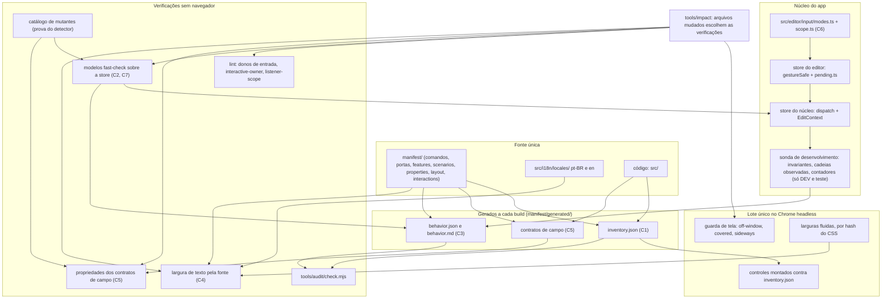

# Investigação: tornar o page builder autoverificável

Data: 2026-10-08. Sessão de pesquisa, análise e projeto. Nenhum arquivo fora de `auditoria/investigacao/` foi alterado.

Material de apoio:
- `auditoria/investigacao/pesquisa/` — as nove notas de pesquisa, uma por tema, com cada fonte aberta e o que ela sustenta;
- `auditoria/investigacao/fontes.md` — todas as fontes, com URL, data de acesso e o que sustentaram;
- `auditoria/investigacao/poc/` — seis provas de conceito, com os scripts e os resultados medidos;
- `auditoria/investigacao/progresso.md` — a memória desta sessão.

Convenção: "fato" vem de fonte aberta nesta sessão ou de medição registrada em `poc/`; "avaliação" é juízo desta investigação. As provas de conceito rodaram com os pacotes já instalados (fast-check 4.10.2, Vitest 5.0.1, TypeScript 6.0.3, Vite 8.3.0, @playwright/test 1.63.0, css-tree 3.2.1, happy-dom 20.14.5), em Node 24.20.0, no Windows 10 desta máquina. Elas não fazem parte da suíte do projeto: ficam em `auditoria/investigacao/poc/`, com configuração própria do Vitest (`poc/vitest.poc.config.ts`), e não alteram arquivo algum do projeto.

---

## 1. Resumo para o dono

**O que vai existir.** Seis mecanismos, todos ligados ao manifesto e ao que o projeto já tem (store, portas, regras de lint, guarda de tela, seletor de impacto):

1. **Inventário gerado a cada build.** Uma lista única, em JSON, de tudo o que o app oferece: funcionalidades, comandos, portas, campos, estados e elementos clicáveis. O diff entre duas versões mostra o que entrou, saiu ou mudou. Ele acusa o botão que existe na tela e não está no manifesto, e a funcionalidade do manifesto que nenhum código executa. Na prova, a varredura do código leu 485 arquivos em 0,5 s e achou 261 elementos interativos, dos quais 81 não têm marca de porta nem de controle local: esses 81 são a primeira lista a revisar.
2. **Detector de quebra sem navegador.** Um "modelo" que roda milhares de sequências aleatórias de ações sobre a store real e confere, depois de cada ação, as regras do histórico, da digitação pendente e dos gestos. Na prova: 300 sequências (8.589 ações) em 0,9 s. Para provar que o detector detecta, plantei 18 defeitos deliberados no código (sem tocar os arquivos: a troca é feita na carga do módulo). Ele acusou 17, cada um com a sequência mínima que o reproduz. O único que passou (abrir outro projeto mantendo o histórico) está numa parte que o modelo da prova ainda não exercita.
3. **Contrato de cada campo.** Todo campo de valor passa por propriedades automáticas: o texto gravado, lido de novo, grava o mesmo texto; o que o campo grava é CSS válido; o número digitado é preservado; um valor válido não é recusado. Na prova: 59 propriedades, 11.800 casos em 0,8 s. A idempotência não quebrou nenhuma vez. A prova achou duas inconsistências para rastrear (seção C5).
4. **Medição de texto sem navegador.** Lendo o arquivo da fonte da interface direto em Node, a largura de cada texto sai igual à do Chrome: erro máximo de 0,015 px em todas as 6.229 mensagens pt-BR e inglês, em 5 tamanhos de fonte. Isso permite acusar "texto que não cabe no campo" sem abrir o navegador, desde que a largura disponível do campo seja conhecida (declarada ou medida uma vez).
5. **Mapa de causa e efeito gerado do código.** As tabelas de transição (por exemplo, a máquina de gestos de ponteiro) saem executando o próprio código, viram diagrama e entram no diff. Na prova, a tabela de 24 combinações da máquina de gestos mostrou 17 combinações que o código ignora em silêncio, uma delas sendo o "botão apertado de novo sem ter sido solto", que merece decisão.
6. **Prova de custo zero em produção.** A instrumentação fica atrás de `import.meta.env.DEV` ou de uma constante do build e some do build de produção; a prova construiu os três modos em memória e confirmou a marca da sonda ausente só no de produção. O projeto já faz isso para a porta de teste (seção C2).

**Quanto tempo cada verificação leva (medido nesta máquina).**

| Verificação | Tempo medido |
|---|---|
| `npm run typecheck` (incremental) | 4,6 s |
| `npm run lint` (com cache) | 2,9 s |
| `node tools/audit/check.mjs --so C2,C7` | 21,8 s |
| modelo do histórico e da store (300 sequências) | 0,9 s de teste, cerca de 3 s com a partida do Vitest |
| contratos de campo (59 propriedades) | 0,8 s de teste |
| largura de 93 mil textos em Node | 86 ms |
| varredura do inventário de interface | 0,5 s |
| prova de que o detector detecta (18 mutantes, um processo cada) | cerca de 60 s |

As verificações sem navegador da área afetada por uma mudança ficam abaixo de 1 minuto; todas as verificações sem navegador juntas, abaixo de 10 minutos, com folga.

**O que muda no dia a dia.** Cada correção da Fase 8 nasce com a falha que ela corrige plantada como mutante: o detector precisa acusar o defeito antes da correção e parar de acusar depois. Um arquivo mudado escolhe sozinho as verificações que o alcançam (o seletor de impacto que já existe, estendido aos novos detectores). Um botão novo sem porta no manifesto, um campo sem contrato ou um texto que não cabe são acusados no lint ou no teste rápido, antes de abrir o navegador.

**O que continua dependendo do navegador.** Controle coberto por outro ou fora da janela, rolagem lateral, ordem de foco, área de transferência real, composição de texto (IME), vazamento de memória, fidelidade visual da exportação, e a largura disponível de cada região quando ela não é um número fixo do CSS. Para isso fica uma verificação em lote único no Chrome headless (a guarda de tela que já existe), escolhida por impacto, com tempo estimado de 1 a 3 minutos por lote (seção C4).

**O que depende de decisão sua** está na seção 5: se o desfazer deve devolver o breakpoint, o estado e a classe em que a mudança foi feita; se o histórico deve sobreviver a recarregar a página; se o projeto aceita dependências de desenvolvimento novas (StrykerJS); qual fonte a interface usa para a medição de texto; e o que fazer quando o ponteiro aperta de novo sem ter soltado.

---

## 2. Capacidades

### C1. Inventário dinâmico

**1. Situação atual.**
- O projeto já gera um inventário a partir do manifesto e das fontes, em memória: `tools/inventory/generate.ts:1` `// The inventory: what the application is made of, derived from the manifest and the source, never written by hand:`. Ele cobre funcionalidades, comandos, portas, módulos donos e contagem de cenários; não cobre campos, estados, eventos nem elementos de interface.
- O verificador do manifesto marca cada id registrado no código: `src/core/commands/registry.ts:116` `// manifest:check reads `.
- Toda porta desenhada pelo componente de porta leva o id do manifesto no DOM: `src/editor/doors/door.tsx:273` `'data-door': entry.ref,`. Os controles locais declarados levam `data-local`, conferidos contra `manifest/layout.json`: `tools/inventory/local-controls.test.ts:8` `const DRAWN = /data-local="([a-z0-9-]+)"/gu;`.
- Os registros de `auditoria/` (2.071 entradas em `entradas.md`, os itens de `estado.md`, 760 requisitos em `requisitos.md`) são um inventário completo, mas escrito por rastreamento, não gerado.

**2. Lacunas.**
- Não existe artefato gerado e versionado do inventário, logo não existe diff entre versões.
- Nada acusa elemento interativo desenhado fora do sistema de portas. A prova P3 achou 81 deles (seção 6 abaixo).
- Campos, itens de estado e entradas não estão no inventário gerado; hoje só existem nos registros de `auditoria/`.

**3. Pesquisa** (detalhe em `pesquisa/c1-inventario.md`).
- API do compilador TypeScript 6.0.3: `ts.createSourceFile` e `ts.forEachChild` bastam para varrer JSX; a 6.0 é compatível em API com a 5.9. O TypeScript 7.0 não tem API programática; a 7.1 terá API nova, e o pacote `@typescript/typescript6` reexporta a da 6.0 (blog do TypeScript, 2026).
- ts-morph 28.0.0 empacota o compilador 6.0.x; não acrescenta capacidade para estas consultas.
- Playwright 1.63: `page.ariaSnapshotJSON()` (novo na 1.63) devolve a árvore de acessibilidade em JSON; `toMatchAriaSnapshot` com `/children: equal` prova a ausência de itens extras.
- dependency-cruiser 18.5.0 (já instalado, script `deps:check`): regras `orphan` e `reachable`; unidade é o módulo, não a função. Knip 6.40.0 acha exports sem referência sem usar a API do TypeScript.
- GrapesJS (`Commands.getAll`, `Components.getTypes`) e tldraw (`useActions`) expõem registros enumeráveis; esse é o padrão "cada controle se declara".

**4. Opções comparadas.**

| Opção | Esforço | Custo em execução | Tempo de verificação | Detecta | Não detecta |
|---|---|---|---|---|---|
| A. Varredura estática com a API do TypeScript (P3) | 2 dias | zero (só ferramenta) | 0,5 s medido | JSX interativo sem `data-door` ou `data-local`; id do manifesto sem referência | elemento criado por `createElement`, interatividade por delegação, o que um componente filho desenha |
| B. Regra de lint "dono do elemento interativo" | 1 dia | zero | dentro dos 2,9 s do lint | o mesmo que A, na hora de escrever, com a mensagem no editor | o mesmo limite de A |
| C. Registro em execução (o DOM montado lido pela porta de teste) | 2 dias | só nos builds de desenvolvimento e teste | uma leitura por estado de tela, no lote do navegador | todo controle montado sem porta, inclusive os de componentes filhos e de `createElement` | telas e estados não visitados |
| D. Árvore de acessibilidade (`ariaSnapshotJSON`) | 2 dias | zero | uma captura por estado, no lote do navegador | controle sem nome, sem papel, nome em inglês na interface pt-BR | `div` clicável sem papel |
| E. Knip e dependency-cruiser | 1 dia | zero | segundos | export e módulo inalcançáveis | uso por id em string (o despacho por manifesto) |
| F. Geração a partir do manifesto mais `auditoria/` como semente | 3 dias | zero | segundos | funcionalidade, comando, porta, campo e estado acrescentados, removidos ou mudados | o que nem o manifesto nem o código declaram |

**5. Recomendação.** F como espinha, alimentada por A e B na origem e por C no navegador:
- `tools/inventory/generate.ts` passa a escrever `manifest/generated/inventory.json` (chaves ordenadas, sem datas nem caminhos absolutos), com seis seções: funcionalidades, comandos, portas, campos (de `manifest/properties.json` e dos codecs), estado (as oito partes da store, `EST-L01-030` a `EST-L01-037`, mais os itens de estado de módulo que a varredura acha) e elementos interativos (da varredura A). O diff é o `git diff` desse arquivo; `tools/gen/check.ts` já acusa arquivo gerado fora de data.
- Um módulo novo `tools/inventory/ui-scan.ts`, a partir de `poc/c1-inventario/varrer.mjs`, produz a lista de elementos interativos.
- Uma regra nova em `tools/lint/plugin.ts`, `builder/interactive-owner`: todo elemento JSX intrínseco interativo leva `data-door`, `data-local` ou uma marca estrutural declarada (sentinela de foco, contêiner de diálogo, item de trilha); os 81 candidatos da prova entram numa lista inicial, cada um com motivo, como `tests/support/screen-guard-allowed.ts` faz.
- No build de teste, a porta de teste (`src/editor/test-port.ts`) expõe a lista de `[data-door]` e `[data-local]` montados; o lote do navegador confronta essa lista com o inventário gerado em cada estado que ele já visita.
- `auditoria/estado.md` e `auditoria/entradas.md` passam a ser conferidos contra a seção de estado e de entradas do inventário gerado (um item novo no código sem registro é pendência no `check.mjs`).

**6. Prova de conceito.** `poc/c1-inventario/varrer.mjs`, resultado em `poc/c1-inventario/resultados.txt`. 485 arquivos de `src/`, 512 ms, TypeScript 6.0.3. Dos 261 elementos JSX interativos e componentes com tratador: 91 são porta, 41 estão dentro de uma porta, 23 envolvem uma porta, 11 recebem atributos espalhados, 10 são controles locais declarados, 4 são componentes com tratador e **81 não têm marca nenhuma**. Os 81 incluem formulários de diálogo, sentinelas de foco, campos de texto de painéis (por exemplo, em `src/editor/shell/captured-inspector.tsx`, 13) e botões de menu. Há também 90 chamadas a `addEventListener` e 5 `createElement` de elementos interativos fora do JSX. A varredura não decide se cada um é defeito; ela produz a lista que a regra B obriga a declarar.

**7. Falhas de aceitação.**
- um `<button onClick>` novo sem `data-door` nem `data-local` num componente do inspector;
- uma porta removida do manifesto e ainda desenhada;
- uma porta acrescentada ao manifesto e nunca desenhada (nenhum `[data-door]` com o id em nenhum estado visitado);
- um comando do manifesto cujo tratador sai da tabela de comandos;
- um campo novo em `manifest/properties.json` sem codec;
- um item de estado novo (variável de módulo mutável) sem registro em `auditoria/estado.md`;
- uma mensagem nova só em `en.json`.

**8. Limites.** A varredura estática não enxerga o que um componente filho desenha nem o que nasce de `createElement`; o registro em execução (C) cobre isso nos estados visitados; os estados não visitados ficam com a revisão da lista da regra B.

---

### C2. Acusação automática de quebra

**1. Situação atual.**
- A store recusa todo estado que o modelo não aceita: `src/core/store/store.ts:273` `const problems = validateDocument(next.document, next.selection, rules);`, e congela o estado em desenvolvimento e teste: `src/editor/store.ts:149` `freeze: options.freeze ?? import.meta.env.DEV,`.
- Já existe uma sonda de invariantes com fast-check sobre a store real, com semente fixa: `tools/runner/invariants.test.ts:162` `{ seed: 20261002, numRuns: 200 },`. Ela confere que desfazer tudo volta ao documento inicial: `tools/runner/invariants.test.ts:160` `if (!deepEqual(store.getState().document, initial)) throw new Error(`. Ela não confere seleção, refazer, fusão, gestos nem digitação pendente, e não confere cada passo de desfazer.
- O executor rápido de cenários roda os 1.831 cenários do manifesto sem navegador onde o cenário permite (`tools/runner/headless.test.ts`).
- A "prova do dente" desliga uma funcionalidade inteira por plugin do Vite e exige que os testes dela falhem: `tools/runner/tooth-plugin.ts:36` `return `. Ela roda no navegador, por funcionalidade.
- O verificador do manifesto tem mutações plantadas próprias (`tools/manifest/plants.ts`).
- O seletor de impacto escolhe as verificações pelos arquivos tocados: `tools/impact/select.ts:9` `// - Browser tests: by what each test executed (the coverage map, tools/impact/map.ts): a test runs when it ran a line a`.

**2. Lacunas.**
- Nenhum detector prova as regras do histórico passo a passo (seleção, refazer, fusão, gesto, digitação pendente).
- A prova de que o detector detecta só existe no nível de funcionalidade e no navegador (o dente); não há medida de detecção em falhas finas (um operador trocado, uma ordem de inversos).
- O seletor de impacto decide os testes de navegador por um mapa de cobertura gravado por uma corrida completa; os detectores novos sem navegador precisam entrar nele.

**3. Pesquisa** (detalhe em `pesquisa/c2-acusacao.md`).
- fast-check 4.10.2: `fc.commands`, `fc.modelRun`, `fc.asyncModelRun`, `fc.scheduledModelRun`; o shrinking reduz só os comandos executados; `seed`, `path` e `replayPath` reproduzem a falha. Não há gancho "depois de cada comando": a invariante é chamada dentro de `run`.
- StrykerJS 10.0.0 com `@stryker-mutator/vitest-runner` 10.0.0: `coverageAnalysis` sempre `perTest`, `vitest.related` ligado, `--incremental`, `mutate` por faixa de linhas; o suporte documentado vai até o Vitest 4.1; nenhuma fonte afirma o Vitest 5.
- Google (mutação por diff, só nas linhas mudadas, ICSE-SEIP 2018), Google TAP (grafo de dependências), Meta (seleção preditiva) e Microsoft (Test Impact Analysis, com recuo para a suíte inteira quando não entende a mudança) concordam em três pontos: um mapa teste-código, um recuo seguro e uma conferência periódica contra a suíte completa.
- Vitest 5: `vitest related` e `--changed` seguem imports estáticos, não dinâmicos; `forceRerunTriggers` força tudo.
- Vite 8.3: `import.meta.env.DEV` é substituído no build e o bloco some por tree-shaking; tldraw valida cada registro a cada escrita e recusa a escrita inválida.

**4. Opções comparadas.**

| Opção | Esforço | Custo em execução | Tempo de verificação | Detecta | Não detecta |
|---|---|---|---|---|---|
| A. Teste baseado em modelo sobre a store (P1) | 3 a 5 dias para todos os grupos de comando | zero | 0,9 s por 300 sequências (medido) | quebra de histórico, de fusão, de gesto, de digitação pendente, de desenho incremental, com a sequência mínima | layout, foco, o que o navegador calcula; comandos que nenhum gerador produz |
| B. Catálogo de mutantes plantados por plugin do Vite (P1) | 1 dia mais 15 minutos por mutante | zero | cerca de 3 s por mutante | a força do detector, falha por falha, com o nome da regra | falhas que ninguém escreveu no catálogo |
| C. StrykerJS 10 no núcleo | 2 dias, mais o piloto com Vitest 5 | zero | não documentado; precisa de piloto | mutantes gerados por operador, sem catálogo à mão | interação entre módulos; mutantes equivalentes ficam como sobreviventes |
| D. Invariantes em desenvolvimento dentro da store | 1 dia | só em desenvolvimento e teste | no instante da escrita | a primeira escrita que quebra uma regra, em qualquer uso, inclusive manual | o que não muda o documento |
| E. Seleção por impacto estendida | 2 dias | zero | segundos para decidir | quais detectores rodar e por quê | mudança em arquivo que o grafo não alcança (o recuo cobre) |
| F. Contratos gerados dos `scenarios` | já existe (executor rápido) | zero | segundos | regressão de comportamento descrito | o que nenhum cenário descreve |

**5. Recomendação.** A + B + D + E, com F mantido como está; C depois de um piloto, se o dono aceitar a dependência (seção 5).
- `tools/runner/model/` recebe o modelo da prova P1, um arquivo por grupo de comandos (histórico e seleção; estilo; estrutura; texto; páginas), sobre `createEditorStore` com o relógio manual e os ids sequenciais que a sonda de invariantes já usa. O modelo lê o manifesto (`history.coalesce`, `undoRestoresSelection`, `transaction`), nunca o código do histórico.
- `tools/runner/mutants.ts` generaliza o plugin da prova (troca de um trecho único por módulo, com a marca de "troca carregada") e o mesmo princípio do `tooth-plugin.ts`, que já troca código na carga; cada mutante declara a regra que quebra. Uma corrida mede a taxa de acusação e falha quando um mutante do catálogo sobrevive sem motivo registrado.
- Em `src/core/store/store.ts`, atrás de `import.meta.env.DEV`, a verificação das regras do histórico a cada publicação (as mesmas da P1: entrada nova só com documento mudado; pilha de refazer vazia depois de entrada nova; `DocumentChange` coerente), que a sonda de produção (P5) prova ausente do build final.
- `tools/impact/select.ts` passa a mapear arquivo para modelo: um arquivo de `src/core/store/`, `src/core/history/` ou `src/editor/input/` escolhe o modelo e o catálogo de mutantes daquele grupo.

**6. Prova de conceito.** `poc/c7-historico/` (detalhada em C7). Resultado em `poc/c7-historico/resultados/resumo.txt`: 18 mutantes, todos carregados com a troca, 17 acusados; tempo até a acusação entre 21 ms e 290 ms de teste; cerca de 3 s por processo do Vitest. O sobrevivente é M15 (abrir outro projeto mantém o histórico), na carga de projeto, que o modelo da prova não exercita porque `project.open` lê um arquivo que só o navegador entrega; o modelo final ganha um passo de carga com o documento entregue direto ao tratador.

**7. Falhas de aceitação.** Os 18 mutantes de `poc/c7-historico/mutantes.ts`, mais:
- `beforeCommand` devolvendo o contexto atual em vez do contexto da digitação (G1);
- `keepTypingBefore` sem efeito (G2, toque);
- `editContextOf` sem o quadro-chave;
- uma porta de `field.step` que soma o passo antes de enviar a intenção (G3);
- `validateDocument` sem a regra de ids únicos;
- `applyPatches` aceitando um índice além do fim.

**8. Limites.** O modelo não pega o que só o navegador calcula, nem comandos que nenhum gerador produz. O que cobre essa parte: o lote de navegador por impacto (C4) e a conferência periódica da suíte completa, que as três fontes de seleção por impacto recomendam.

---

### C3. Mapa executável de comportamento

**1. Situação atual.**
- As cadeias de causa e efeito existem por escrito em `auditoria/fluxos/` e `auditoria/interacoes/` (8.456 pares de 353 itens de estado), montadas por rastreamento com citação; `tools/audit/matriz.mjs` gera `auditoria/matriz.md` a partir das marcas dos fluxos.
- O manifesto declara, por cenário, a porta, os passos, o documento, a seleção, o histórico e regiões do editor esperados (`expect.editor.regions` em 202 dos 1.831 cenários).
- A máquina de gestos é uma função pura: `src/editor/input/pointer/machine.ts:79` `export function step(machine: Machine, event: MachineEvent, dragThreshold = DRAG_THRESHOLD): { readonly machine: Machine; readonly effect: Effect } {`.

**2. Lacunas.**
- O mapa de `auditoria/` é texto mantido por rastreamento: quando o código muda, ele fica velho até alguém refazer o rastreamento; nada o confere automaticamente contra a execução.
- As tabelas de transição (gestos, campos, menus) não existem como dado; estão dentro das funções.

**3. Pesquisa** (detalhe em `pesquisa/c3-mapa.md`).
- XState 5.33.2: 14,6 KB gzip; `xstate/graph` com `getShortestPaths`, `getSimplePaths`, `createTestModel` e `path.test`; `@xstate/test` 0.5.1 exige xstate 4 e não serve.
- tldraw modela ferramentas como statechart (`StateNode`, `transition`, `getPath`), com ganchos `before-event` e `event` para observar; não declara transições legais.
- Máquina sem biblioteca: união discriminada, tabela com `satisfies Record<...>` e verificação exaustiva com `never` (Handbook do TypeScript); um enumerador de caminhos de cerca de 30 linhas.
- LanguageService do TypeScript 6.0.3: `prepareCallHierarchy`, `provideCallHierarchyOutgoingCalls`, `findReferences`; a hierarquia estática para no despacho por id do manifesto.
- Excalidraw: o `ActionManager` faz todas as portas convergirem em `perform`, o mesmo desenho da regra G3.
- Mermaid `stateDiagram-v2` dá a saída legível por gente.

**4. Opções comparadas.**

| Opção | Esforço | Custo em execução | Tempo | Detecta | Não detecta |
|---|---|---|---|---|---|
| A. Tabela extraída executando a função pura (P6) | 0,5 dia por máquina | zero | menos de 1 s | toda mudança de transição, como diff; combinações ignoradas em silêncio | código fora da função |
| B. Máquina como dado (tabela `satisfies`) que o código executa | 2 a 4 dias por máquina | zero | compilação | estado ou evento sem tratamento, na compilação | efeitos fora da máquina |
| C. XState com `createTestModel` | 3 dias, mais 14,6 KB se for do app | 14,6 KB gzip ou zero se só em teste | depende dos caminhos | divergência entre modelo e app nos caminhos gerados | o que o modelo não declara; é uma segunda notação |
| D. Cadeias observadas em execução: a store em desenvolvimento registra, por comando, as partes do estado escritas e as vistas notificadas | 3 dias | só em desenvolvimento e teste | junto do modelo C2 | cadeia que mudou (um comando que passou a escrever outra parte) | leitura de estado fora da store |
| E. Grafo estático pelo LanguageService | 3 dias | zero | não medido | elo declarado sem caminho de chamada | despacho por id |

**5. Recomendação.** A para as máquinas puras que já existem; B onde a máquina hoje está espalhada (modos de interação, C6); D como o mapa vivo de comando → estado → vista. C fica fora: o projeto já tem o manifesto como fonte, e uma segunda notação duplica a tabela.
- `tools/map/` gera, a cada build, `manifest/generated/behavior.json` e `manifest/generated/behavior.md` (Mermaid): as tabelas de transição (A e B), e, para cada comando, as partes do estado que ele escreve e as vistas que leem essas partes, observadas pelo modelo C2 (D).
- `auditoria/matriz.md` passa a ser conferido contra o observado: um par que a execução mostra e a matriz não tem é pendência; a matriz escrita à mão deixa de ser a fonte do "quem escreve o quê".
- O mapa da fase 7 vira artefato gerado: `tools/audit/matriz.mjs` lê as marcas dos fluxos (como hoje) e também o `behavior.json`; a diferença entre os dois é a lista de rastreamentos a refazer.

**6. Prova de conceito.** `poc/c3-mapa/tabela.poc.ts`, resultado em `poc/c3-mapa/resultados.txt`. A tabela de `step` sai do código em 24 combinações de fase e evento, com o limiar de arraste lido do manifesto (4 px), e vira diagrama Mermaid. 17 combinações deixam a máquina igual e sem efeito. A maioria é legítima (o movimento durante o arraste é tratado pelo dono do ponteiro, fora da máquina), mas uma pede decisão: um segundo `down` do mesmo ponteiro com a máquina em `pressed` ou `dragging` (o `up` se perdeu) é ignorado: `src/editor/input/pointer/machine.ts:90` `if (event.type === 'down' || event.pointer !== machine.pointer) return { machine, effect: null };`. O Excalidraw encerra o gesto anterior nesse caso (`maybeCleanupAfterMissingPointerUp`, nota C6). Decisão em aberto na seção 5.

**7. Falhas de aceitação.**
- uma transição nova em `step` sem a tabela gerada atualizada (o diff acusa);
- um comando que passa a escrever `state.ui` sem estar no mapa;
- uma vista (Camadas) que deixa de ser notificada por uma mudança de seleção;
- `followSelection` deixando de abrir a página do nó selecionado por um desfazer.

**8. Limites.** O mapa observado só contém o que o modelo executou; o que nenhum gerador produz fica fora. A regra de cobertura do mapa (todo comando com pelo menos uma execução observada) acusa o comando nunca exercitado, e o rastreamento com citação de `auditoria/` continua para o caso que a execução não alcança.

---

### C4. Quebra de interface detectada sem navegador

**1. Situação atual.**
- A guarda de tela mede no navegador as seis famílias de defeito: `tests/support/screen-guard.ts:29` `export type FindingKind = 'cut' | 'wrapped' | 'off-window' | 'covered' | 'english' | 'sideways';`.
- 50 medições gravadas em `auditoria/medicoes/` (Fase 6).
- A fonte da interface é a fonte do sistema: `src/ui/tokens.css:4` `--font-ui: "Segoe UI Variable Text", "Segoe UI", system-ui, sans-serif;`. Nesta máquina (Windows 10) só existe "Segoe UI" (`segoeui.ttf` e `seguisb.ttf` em `C:\Windows\Fonts`).
- Duas rotinas já esperam as fontes antes de medir: `src/editor/shell/row-fit.ts:125` `void document.fonts.ready.then(soon);`.

**2. Lacunas.** Toda verificação de corte e de cobertura depende de abrir o Chrome. Não há medida de texto sem navegador, nem declaração da largura disponível por região.

**3. Pesquisa** (detalhe em `pesquisa/c4-interface.md`).
- Pretext 0.0.9 (`prepare` e `layout`): mede só texto, exige `OffscreenCanvas` ou canvas do DOM e lança erro em Node puro; declara o Windows como não testado; registra que o canvas do Chrome perde o kerning nos espaços (Arial 15 px, "x A x": 33,34 px no canvas e 31,69 px no DOM).
- @napi-rs/canvas 1.0.10 tem binário para Windows x64; skia-canvas 3.0.8 não nomeia Windows x64; nenhuma fonte mostra largura de canvas em Node igual à do Chrome no Windows.
- Yoga 3.2.1, Taffy e Satori não implementam o CSS real do builder (texto só por função de medida, subconjunto de CSS).
- happy-dom 20.14.5 devolve `new DOMRect()` em `getBoundingClientRect` e zero nas medidas de layout.
- Playwright 1.63: snapshot de acessibilidade sem geometria, a não ser com `boxes`, que exige navegador.
- Pseudo-localização: expansão de 200 a 300% para textos de até 10 caracteres e de 130% acima de 70 (tabela IBM/W3C); en-XA e qps-ploc.
- css-tree 3.2.1 e stylelint 17.16.0: nenhuma regra nativa para `nowrap` sem contenção ou para item flex sem `min-width: 0`; exige plugin ou `walk`.

**4. Opções comparadas.**

| Opção | Esforço | Custo em execução | Tempo | Detecta | Não detecta |
|---|---|---|---|---|---|
| A. Largura de texto lida do arquivo da fonte, com GPOS (P2) | 2 dias | zero | 86 ms para 93 mil larguras | texto mais largo que a largura disponível, em pt-BR, inglês e pseudo-expandido | posição, cobertura, rolagem; largura disponível que não seja conhecida |
| B. Pretext com canvas de Node | 2 dias mais pacote nativo novo | zero | não medido | quebra de linha em parágrafo | precisão no Windows não declarada; dependência nativa |
| C. Larguras disponíveis declaradas por região e campo, derivadas dos tokens | 3 dias | zero | junto de A | o texto mais longo de cada chave contra a coluna do seu campo | regiões de largura fluida (calculada) |
| D. Uma medição em lote das larguras disponíveis no Chrome, guardada por hash do CSS | 2 dias | zero | 1 a 3 minutos por lote, só quando o CSS muda | larguras fluidas reais, nas duas configurações de tela | mudança de conteúdo que altera o layout em volta |
| E. Análise estática do CSS com css-tree | 2 dias | zero | segundos | `white-space: nowrap` sem `overflow`/`text-overflow`; item flex sem `min-width: 0` em filho direto | cascata e herança |
| F. Snapshot de acessibilidade como verificação estrutural | 1 dia | zero | no lote do navegador | nome em inglês na interface pt-BR, controle sem nome | geometria |
| G. Yoga ou Taffy | 10 dias ou mais | zero | não medido | overflow num modelo traduzido | o CSS real; descartado |

**5. Recomendação.** A + C + D + E, com a guarda de tela no lote final.
- `tools/ui-fit/font.ts`, a partir de `poc/c4-texto/medir.mjs`: leitor de TrueType (cmap, hmtx, GPOS kern) e a largura de um texto num tamanho e peso.
- `tools/ui-fit/check.ts`: para cada porta do manifesto, a chave do rótulo (`labelKey`) e a região onde ela é desenhada (`manifest/layout.json`) dão o texto e a coluna; o texto mais longo entre pt-BR, inglês e a pseudo-expansão da chave tem de caber na largura disponível, com folga de 1 px. A largura disponível vem dos tokens (`--size-inspector`, `--size-control`) quando é fixa, e do lote D quando é fluida.
- `tests/support/screen-guard.ts` continua sendo a prova final das famílias `off-window`, `covered` e `sideways`, num lote único escolhido por impacto.
- A regra de lint de CSS (`tools/lint/plugin.ts`, linguagem css) ganha as duas checagens de E.

**6. Prova de conceito.** `poc/c4-texto/medir.mjs`, resultado em `poc/c4-texto/resultados.txt`. 6.229 textos distintos de `src/i18n/locales/pt-BR.json` e `en.json`, nos cinco pares de tamanho e peso dos tokens (11/400, 12/400, 12/600, 13/600, 15/400), contra `getBoundingClientRect` de um `span` no Chrome headless desta máquina:

| Modo | Erro absoluto mediano | p95 | Máximo | Textos com erro até 0,5 px |
|---|---|---|---|---|
| sem kerning, peso 400 | 0,009 px | 0,41 a 0,56 px | 2,8 a 3,8 px | 92,7 a 95,3% |
| tabela `kern` antiga, peso 400 | 0,15 a 0,20 px | 0,70 a 0,96 px | 4,1 a 5,5 px | 84,3 a 90,5% |
| GPOS `kern`, todos os pesos | 0,007 a 0,008 px | 0,014 a 0,015 px | 0,015 px | todos os 6.229 |

Node calculou as 93.435 larguras em 86 ms; o Chrome mediu 31.145 em cerca de 0,4 s, sem contar a partida. O resíduo de 0,015 px é o arredondamento do layout do Chrome (1/64 px, nota C4). A prova cobre texto latino sem `letter-spacing`, sem `text-transform` e sem emoji; a prova B (Pretext) não foi feita porque exige pacote nativo novo, e a A dispensou essa dependência.

**7. Falhas de aceitação.**
- uma mensagem pt-BR nova 30% mais longa que a coluna do seu campo;
- `--size-inspector` reduzido de 336 px para 280 px;
- uma porta movida para uma região mais estreita;
- `white-space: nowrap` acrescentado a um rótulo sem `text-overflow`;
- `min-width: 0` removido de um item flex do inspector;
- uma chave nova só em inglês (a família `english`).

**8. Limites.** Nenhuma técnica sem navegador prova que um controle não está coberto nem fora da janela: isso depende de posição, `z-index` e corte de ancestrais. Isso continua com a guarda de tela no lote do navegador, 1 a 3 minutos por lote (estimativa: a abertura do editor e a passagem da guarda nas duas configurações). A medida de texto vale para a fonte desta máquina: no Windows 11, "Segoe UI Variable Text" passa a ser a fonte usada e a tabela precisa ser lida desse arquivo (decisão em aberto na seção 5).

---

### C5. Controlador global de entradas e saídas

**1. Situação atual.**
- O registro único de digitação pendente existe e é aplicado na store do editor: `src/editor/store.ts:234` `const at = context ?? beforeCommand(id, args, changesDocument);`. O campo registra a digitação com o contexto em que ela começou: `src/editor/shell/field.tsx:650` `holdTyping({ field: element, region: regionOf(element), context: typing.context, owns: ownsProperty(command, NUMBER_FIELD_CONTEXT, property), keep: keepNow });`.
- Todas as portas de um passo de campo levam a mesma intenção ao mesmo tratador (G3): `src/editor/inspector/number-field.ts:82` `export const stepField = registerHandler('field.step', (context, { property, value, direction, size, modifier }) => {`, e o ponto de partida é decidido num lugar só: `src/editor/inspector/number-field.ts:55` `function startOf<Ui>(context: HandlerContext<Ui>, property: string, value: string): string {`.
- A leitura de um valor digitado é única: `src/core/style/set.ts:235` `export function readValue<Ui>(context: HandlerContext<Ui>, property: string, typedText: string): ReadValue | null {`, com a vírgula decimal do pt-BR tratada: `src/core/style/set.ts:241` `const decimal = /^\s*[+-]?\d+,\d+\s*[a-z%]*\s*$/i.test(typedText) ? typedText.replace(',', '.') : typedText;`.
- A escrita do número tem regra única de arredondamento: `src/core/style/codecs.ts:68` `export function writeNumber(n: number): string {`.
- O lexer do css-tree já existe no projeto, montado das sintaxes oficiais: `src/manifest/css.ts:85` `export function matchImplemented(property: string, value: string): string | null {`.
- O que o editor aceita depende de `CSS.supports` do navegador (porta `css`); fora do navegador a porta aceita tudo: `src/core/ports/css.ts:13` `export const anyCss: CssSupport = {`.

**2. Lacunas.**
- Não existe um registro que liste, por campo, o contrato inteiro (gramática, unidades, limites, mensagens, comando, contexto, volta da store); as partes existem em lugares diferentes (manifesto, codecs, `field.tsx`, `number-field.ts`).
- Nenhuma verificação automática percorre todos os campos com as propriedades de ida e volta, gramática, preservação e aceitação.
- Fora do navegador, nada substitui `CSS.supports`; por isso as verificações sem navegador aceitam valores que o navegador recusaria.

**3. Pesquisa** (detalhe em `pesquisa/c5-campos.md`).
- css-tree 3.2.1: `lexer.matchProperty` custa cerca de 10 µs por valor curto e 100 µs por gradiente de 20 paradas; recusa unidade desconhecida e `width: -5px`; aceita `calc(1px + )`, `rgb(300,0,0)` e blur negativo; a mensagem é sempre `Mismatch` em inglês, e o dado útil é `mismatchOffset`; `var()` não é casado.
- zod 4.6.5: `z.codec` (parse e format com a mesma validação), `z.config(z.locales.ptBR())`, `z.toJSONSchema` com `io: 'input'` e `'output'`.
- fast-check 4.10.2: `stringMatching` gera `-0em`, um caso de borda real.
- React Aria: `commit()` no Enter e no blur faz parse, limite, passo, reformatação e gravação; texto inválido volta ao último valor confirmado. Base UI separa `onValueChange` de `onValueCommitted`; Alt 0,1 e Shift 10. Chrome DevTools usa 1, 10, 100 e 0,1.
- Literatura (Wlaschin; Hypothesis): `format(parse(x))` estável é idempotência de normalização, não ida e volta estrita.

**4. Opções comparadas.**

| Opção | Esforço | Custo em execução | Tempo | Detecta | Não detecta |
|---|---|---|---|---|---|
| A. Propriedades sobre os codecs reais, por propriedade do manifesto (P4) | 2 dias | zero | 0,8 s para 59 propriedades (medido) | idempotência, número perdido, valor válido recusado, texto gravado fora da gramática | o que o codec e o leitor erram de forma coerente |
| B. Lexer do css-tree como substituto de `CSS.supports` nas verificações sem navegador | 0,5 dia | zero | 10 a 100 µs por valor | valor que o navegador recusaria | `calc` interno, faixa fora da gramática, `var()` |
| C. Registro de contrato por campo, gerado do manifesto e dos codecs | 4 dias | zero | compilação | campo sem contrato, mensagem sem chave, unidade sem conversão | comportamento de layout |
| D. Máquina única de campo (ocioso, rascunho, gesto, inválido) no registro | 5 dias | zero | junto de A | campo que implementa o próprio ciclo de confirmação e cancelamento | o que fica fora do campo |
| E. zod `codec` como forma do contrato | 3 dias | zero | microssegundos | divergência entre limites declarados e aplicados | limites escritos em função |
| F. Todas as portas dão o mesmo resultado (G3), por `fc.commands` | 2 dias | zero | dezenas de ms | porta que decide por conta própria | diferença só de layout |

**5. Recomendação.** A + B + C + F agora; D na Fase 9, quando a revisão de `field.tsx` (110 KB) for feita; E fica fora, porque os codecs já são o par parse e format do projeto e um segundo formalismo duplica a fonte.
- `src/core/style/contracts.ts` (novo): para cada propriedade e composite do manifesto, o contrato gerado a partir de `manifest/properties.json`, de `factsOf` e do codec: gramática (a propriedade no lexer), unidades, palavras-chave, passo e fatores (de `manifest/interactions.json`), chaves de mensagem de recusa, comando que grava e se o campo é dono do comando (o `owns` do registro de digitação).
- `tools/runner/field-contracts.test.ts`, a partir de `poc/c5-campos/ida-e-volta.poc.ts`, percorre todos os contratos com as quatro propriedades da prova, mais "todas as portas iguais" (F) e "o texto mais longo cabe" (via C4).
- Uma porta `css` de teste baseada em `matchImplemented` substitui `anyCss` nas verificações sem navegador, de modo que elas recusem o que o navegador recusaria.

**6. Prova de conceito.** `poc/c5-campos/ida-e-volta.poc.ts`, resultado em `poc/c5-campos/resultados.txt`. 59 propriedades com unidades, 200 entradas por propriedade (números de dupla precisão, `-0`, `.5`, `1e3`, `1,5`, todas as unidades oferecidas, com e sem espaço), 11.800 casos em 773 ms:
- idempotência: 0 quebras;
- exceções: 0;
- gramática: 1.842 textos gravados que o lexer recusa. Com a porta `anyCss` da prova, o editor gravaria comprimentos negativos em `width`, `padding-*` e `font-size` e textos como `-228 ex` em `grid-template-columns`; no navegador, `CSS.supports` recusa esses valores antes. A prova mostra que a verificação sem navegador precisa da porta B;
- número: 81 casos em 9 propriedades de vários valores (`grid-template-columns`, `translate`, `rotate`, `scale`, `object-position`, `transform-origin`, `perspective-origin`, `font-stretch`) gravam o número como digitado (`12.345678px`), enquanto as propriedades de um comprimento arredondam a quatro casas pelo `writeNumber`. É uma diferença de normalização entre codecs, a rastrear antes de virar regra;
- recusa: `background-position-x` e `background-position-y` recusam `0px`, `6px` e `.5dvw`, que a sintaxe aceita e que a lista gerada de unidades da própria propriedade oferece. A propriedade é `part-of-composite` e as portas que a escrevem são do composite `background-position`; a rastrear se algum caminho (a barra de comandos com `style.set`) chega ao longhand.

**7. Falhas de aceitação.**
- `writeNumber` deixando passar `-0`;
- a vírgula decimal deixando de ser lida como ponto;
- uma unidade oferecida que o codec não lê;
- um passo de campo com Shift multiplicando por 100;
- a roda de rolagem num campo somando o passo antes de enviar a intenção;
- uma mensagem de recusa sem chave em `pt-BR.json`;
- Esc do campo gravando o rascunho em vez de descartá-lo;
- a volta da store sobrescrevendo um rascunho pendente.

**8. Limites.** O contrato não prova a aparência do campo. Os buracos do lexer (`calc` interno, blur negativo, canais de cor, `var()`) exigem casos declarados no contrato; o navegador continua sendo a prova final do que `CSS.supports` aceita, no lote por impacto.

---

### C6. Controlador global de eventos e estados

**1. Situação atual.**
- Há donos de entrada impostos por lint: `builder/pointer-owner`, `builder/gesture-owner`, `builder/keyboard-owner` e `builder/frame-owner` (registrados em `tools/lint/plugin.ts`, aplicados em `eslint.config.js`).
- A máquina de gestos é pura e testável: `src/editor/input/pointer/machine.ts:79` `export function step(machine: Machine, event: MachineEvent, dragThreshold = DRAG_THRESHOLD): { readonly machine: Machine; readonly effect: Effect } {`.
- O registro de digitação pendente grava antes de qualquer comando de fora do campo: `src/editor/input/pending.ts:76` `export function beforeCommand(id: CommandId, args: unknown, changesDocument: boolean): EditContext | undefined {`.
- O teclado ignora a composição de IME: `src/editor/input/keymap.ts:384` `if (event.isComposing || event.keyCode === 229) return;`.
- Um despacho que chega com um gesto aberto espera o fim do gesto, no contexto em que foi pedido: `src/editor/store.ts:243` `waiting.push(() => void store.dispatch(id, args, asked));`.
- A varredura P3 contou 90 chamadas a `addEventListener` em `src/` fora dos testes, e `auditoria/entradas.md` registra 2.071 entradas.

**2. Lacunas.**
- Os modos de interação (ocioso, digitando, arrastando, redimensionando, menu aberto) não são uma máquina única: a digitação vive em `pending.ts`, o gesto em `machine.ts` e no dono do ponteiro, o menu em cada componente. Nada acusa uma transição ilegal entre eles (por exemplo, menu aberto durante um arraste).
- Ouvintes, timers e observers não têm escopo de vida comum; a limpeza é conferida pelo rastreamento (seção "Limpeza" dos fluxos), não automaticamente.
- Corridas assíncronas (leitura de arquivo que resolve durante um gesto, autosave durante digitação) são cobertas por regras pontuais, não por exploração de intercalações.

**3. Pesquisa** (detalhe em `pesquisa/c6-eventos.md`).
- tldraw: ponto único `editor.dispatch(info)`; `pointer_move`, `wheel` e `pinch` vão para uma fila processada uma vez por quadro; `before-event` e `event` em volta da máquina; `markEventAsHandled` define o dono sem `stopPropagation`; nenhuma tabela de transições legais.
- ProseMirror e Lexical: dono por cadeia (o primeiro tratador que devolve `true`); no Lexical, por prioridade; todo `register*` devolve a função de remoção, `mergeRegister` agrupa.
- Excalidraw: sem máquina de modos; limpeza centralizada por um emissor; `maybeCleanupAfterMissingPointerUp` encerra o gesto anterior quando o `pointerup` não chegou.
- DOM: a opção `signal` em `addEventListener` remove o ouvinte ao abortar; `AbortSignal.any` é Baseline desde março de 2024; `lostpointercapture` cobre `pointerup`, `pointercancel` e liberação programática.
- React 19: StrictMode faz setup, cleanup e setup extra para expor limpeza ausente.
- fast-check 4.x: `fc.scheduler` com `scheduleFunction` e `waitIdle`; `waitOne` e `waitAll` obsoletos desde a 4.2.0.
- Vitest 5: `vi.getTimerCount()` com timers falsos; CDP `DOMDebugger.getEventListeners` com `depth: -1` e `pierce: true` conta ouvintes no navegador.

**4. Opções comparadas.**

| Opção | Esforço | Custo em execução | Tempo | Detecta | Não detecta |
|---|---|---|---|---|---|
| A. Máquina de modos única, tabela de transições permitidas, acusação no feed de incidentes | 5 dias | uma consulta à tabela por transição | compilação e modelo C2 | transição ilegal (menu abrindo durante arraste, dois gestos), estado sem tratamento | evento que nunca chega à máquina |
| B. Escopo de vida por modo e por componente (`AbortController` e funções de remoção) | 4 dias | desprezível | junto do modelo | ouvinte, timer ou observer que sobrevive ao modo | o que não passa pelo escopo |
| C. Contador de ouvintes, timers e observers em desenvolvimento e teste | 2 dias | só em desenvolvimento e teste | por teste | vazamento de ouvinte após desmontar, em happy-dom | o que só existe no iframe real |
| D. Corridas com `fc.scheduler` sobre as portas assíncronas injetadas | 3 dias | zero | segundos | intercalação que quebra uma regra (arquivo que resolve durante gesto, autosave durante digitação) | eventos reais do navegador |
| E. Barramento tipado (mitt, nanoevents) | 2 dias | 1 KB | — | — | não decide dono nem ordem; descartado |
| F. Regra de lint "ouvinte só pelo escopo" | 1 dia | zero | no lint | `addEventListener` cru fora do escopo | `on*` de JSX (o React limpa) |

**5. Recomendação.** A + B + C + D + F, em `src/editor/input/`:
- `src/editor/input/modes.ts` (novo): a união discriminada dos modos e a tabela `satisfies Record<Modo, Partial<Record<Evento, Transicao>>>`; `pending.ts`, o dono do ponteiro e os menus passam a entrar e sair de modo por ela; uma transição fora da tabela vai para o feed de incidentes (`src/core/incidents.ts`) e, em desenvolvimento, lança, como a store já faz com estado inválido.
- `src/editor/input/scope.ts` (novo): `openScope(nome)` devolve um `AbortSignal` e um registrador de timers e observers; sair do modo aborta o escopo.
- A regra de lint nova `builder/listener-scope` em `tools/lint/plugin.ts`: `addEventListener` só com `{ signal }` de um escopo.
- Em desenvolvimento e teste, `scope.ts` conta o que está aberto; o modelo C2 e os testes de componente conferem zero depois de desmontar.
- As portas assíncronas (leitura de arquivo, autosave, clipboard) entram no modelo C2 por `fc.scheduledModelRun`.
- O mapa C3 gera o diagrama dos modos a partir de `modes.ts`.

**6. Prova de conceito.** P6 (`poc/c3-mapa/`) extraiu a tabela da máquina de gestos e listou as 17 combinações ignoradas em silêncio; uma delas (`down` com `pressed`) é a lacuna que a opção A acusa. A P1 exercitou o registro de digitação pendente e o adiamento de comando durante gesto: os mutantes M16 (comando sem gravar antes a digitação), M17 (campo novo descartando a digitação do anterior) e M18 (comando que chega durante o gesto se perde) foram acusados. A contagem de ouvintes (C) não teve prova nesta sessão: a montagem do editor em happy-dom é a etapa seguinte.

**7. Falhas de aceitação.**
- um `addEventListener` sem remoção num efeito de componente;
- um `ResizeObserver` que não desconecta ao fechar o menu;
- um `setTimeout` de autosave que sobrevive à troca de projeto;
- um menu que abre durante um arraste de alça;
- um segundo `down` com gesto aberto;
- uma leitura de arquivo que resolve depois de o nó alvo ser apagado e grava mesmo assim;
- `keepTypingBefore` sem efeito num toque.

**8. Limites.** O que acontece só no navegador real (captura de ponteiro perdida, eventos do iframe, IME real) fica com o lote do navegador e o CDP (`DOMDebugger.getEventListeners`). O motion runtime (`src/editor/motion/runtime/`) é o script da página publicada e fica fora do dono único por decisão já registrada no lint.

---

### C7. Undo e redo precisos

**1. Situação atual** (implementação lida por inteiro: `src/core/history/history.ts`, `src/core/history/transaction.ts`, `src/core/store/store.ts`).
- Uma transação guarda os patches, os inversos e a seleção de antes e de depois: `src/core/history/transaction.ts:21` `readonly selectionBefore: Selection;`. O desfazer aplica os inversos e devolve a seleção de antes: `src/core/history/history.ts:58` `selection: tx.selectionBefore,`.
- Os inversos são derivados na aplicação de cada patch, não escritos à mão por comando (modelo "patches", nota C7).
- A fusão exige mesma chave e janela de tempo: `src/core/history/history.ts:26` `if (last !== undefined && within !== null && tx.coalesceKey !== null && tx.coalesceKey === last.coalesceKey && tx.at - last.at <= within) {`; a chave é comando, alvo e propriedade: `src/core/store/store.ts:343` `return { key: `; qualquer comando no meio interrompe: `src/core/store/store.ts:405` `lastMergeable = null;`.
- Um gesto vira uma entrada no commit, e o cancelamento volta ao estado de antes: `src/core/store/store.ts:750` `if (state !== before) publish(commit({ ...state, document: before.document, selection: before.selection, history: before.history }, 'a cancelled gesture'), current.inverses);`.
- Abrir outro projeto esvazia o histórico: `src/core/store/store.ts:489` `selection: [], history: EMPTY_HISTORY`.
- A chave `__proto__` num patch vira propriedade comum: `src/core/history/transaction.ts:65` `Object.defineProperty(container, key, { value, writable: true, enumerable: true, configurable: true });`.
- O histórico não sobrevive a recarregar: `src/editor/persistence/autosave.ts:11` `the history starts empty`.

**2. Lacunas.**
- A transação não guarda o contexto de edição (breakpoint, estado, classe-alvo, quadro-chave). O documento volta exatamente, porque os patches nomeiam o caminho; o editor continua mostrando o contexto atual, e um desfazer feito em outro breakpoint muda algo que a pessoa não vê. As fontes que restauram seleção a gravam no item do histórico (bookmark do ProseMirror, meta do Yjs, `appState` observado do Excalidraw). Decisão em aberto na seção 5.
- O cancelamento de gesto devolve documento, seleção e histórico, não o `ui` (o mesmo vale para `commandGroup`).
- Nenhuma verificação prova, passo a passo, desfazer e refazer exatos, fusão correta e a interação com digitação pendente (seção C2).

**3. Pesquisa** (detalhe em `pesquisa/c7-historico.md`).
- prosemirror-history 1.5.1: passos invertidos com mapeamento, `newGroupDelay` 500 ms, `closeHistory`, meta `addToHistory: false`, seleção como bookmark no primeiro item do grupo; o histórico não entra em `toJSON`.
- @lexical/history 0.52.0: snapshots de `EditorState` com compartilhamento estrutural; mesclagem por função pura com relógio injetável (300 ms), tags `history-merge` e `history-push`.
- tldraw 5.5.2: diffs de registros com marcas (`markHistoryStoppingPoint`, `bailToMark`, `squashToMark`), modos `record`, `record-preserveRedoStack` e `ignore`; undo com o gravador pausado; o estado da instância fica fora.
- Excalidraw 0.18.1: `CaptureUpdateAction.IMMEDIATELY`, `NEVER`, `EVENTUALLY`; só a mudança de elementos esvazia o redo.
- Figma (2019): desfazer muito, copiar e refazer até o presente não muda o documento.
- Immer 11.1.21 e Mutative 1.3.0: `inversePatches` devolvem a base; os patches do Immer não são mínimos; o benchmark do Mutative é do próprio autor.
- Yjs 13.6.33: `captureTimeout` 500 ms, `trackedOrigins`, meta por item para restaurar seleção.
- Nenhuma fonte documenta histórico persistido em salvar e abrir.

**4. Opções comparadas.**

| Opção | Esforço | Custo em execução | Tempo | Detecta ou garante | Não detecta ou não garante |
|---|---|---|---|---|---|
| A. Manter patches com inverso derivado (hoje) e acrescentar o contexto à transação | 2 dias | alguns bytes por entrada | — | desfazer devolve também o contexto em que a mudança foi feita | — |
| B. Snapshot estrutural do documento por entrada | 4 dias | uma referência por entrada | — | igualdade exata por construção | contexto e rascunho, que ficam fora do snapshot |
| C. Comando com inverso escrito à mão | 15 dias ou mais | mínimo | — | memória mínima | divergência entre comando e inverso |
| D. Immer ou Mutative | 5 dias mais pacote | patches não mínimos (Immer) | — | inverso derivado | nada que A não tenha; descartado |
| E. Modelo fast-check das regras do histórico (P1) | 3 dias | zero | 0,9 s por 300 sequências | desfazer e refazer exatos, fusão, gesto, digitação pendente, desenho incremental | carga de projeto (enquanto não houver passo de carga) |

**5. Recomendação.** A + E.
- `src/core/history/transaction.ts`: a `Transaction` ganha `contextBefore: EditContext` (o contexto capturado na primeira digitação, ou o do editor quando não há digitação), gravado em `src/core/store/store.ts` no mesmo ponto onde a seleção de antes é gravada. O uso dele no desfazer depende da decisão D-A da seção 5; gravar o dado não muda o comportamento.
- O cancelamento de gesto e de grupo devolve também o `ui` de antes, ou a regra registra por que não devolve.
- `tools/runner/model/history.test.ts`, a partir de `poc/c7-historico/modelo.poc.ts`, com um passo de carga de projeto e um de troca de breakpoint durante digitação.
- O histórico continua sem persistência até a decisão D-B.

**6. Prova de conceito.** `poc/c7-historico/`: `modelo.poc.ts` (o modelo), `mutantes.ts` (18 mutantes), `rodar-mutantes.mjs` (a corrida), resultados em `poc/c7-historico/resultados/`.
- O modelo é a pilha de entradas { antes, depois } que a pessoa espera, montada pelas regras do manifesto (`history.coalesce`, `undoRestoresSelection`) e pelo que cada passo publica; não reusa o código do histórico.
- Passos: selecionar, acrescentar à seleção, estilo, passo de campo, rajada de passos com espera (0, 500, 1.000, 1.001 e 3.000 ms), mover, inserir, apagar, duplicar, desfazer, refazer, esperar, digitar (o registro de `pending.ts` com um campo real em happy-dom) e gesto (com seleção dentro, com comando de fora durante, com commit ou cancelamento).
- Conferências depois de cada passo: entrada nova só com documento mudado; fusão só quando o manifesto permite; publicação sem mudança de documento não mexe no histórico; desfazer devolve documento e seleção de antes; refazer, os de depois; cada `DocumentChange` leva `before` a `after` pelos próprios patches; a digitação pendente é gravada antes de qualquer comando de fora; o gesto não mexe no histórico enquanto aberto. No fim: desfazer tudo e refazer tudo.
- Linha de base: 300 sequências, 8.589 passos, 883 desfazer, 221 fusões, 605 gestos, 591 digitações, 0,87 s, nenhuma divergência.
- A primeira divergência da linha de base foi do modelo: um gesto sem comando nenhum não interrompe a fusão de setas. A nota de `history.nudgeBurstWindow` em `manifest/interactions.json` diz "no other command in between", e o código segue a nota; o modelo foi ajustado. É o tipo de pergunta que o modelo obriga a responder por escrito.
- Mutantes (cada um troca um trecho único na carga do módulo; os arquivos em disco não mudam):

| Mutante | Regra que quebra | Acusado | Primeira regra acusada |
|---|---|---|---|
| M01 | desfazer restaura a seleção de depois | sim | o estado do desfazer nomeia nó inexistente |
| M02 | refazer restaura a seleção de antes | sim | o estado do refazer nomeia nó inexistente |
| M03 | a fusão inverte a ordem dos inversos | sim | desfazer não voltou ao documento de antes |
| M04 | entrada nova não esvazia o refazer | sim | entrada nova não esvaziou a pilha de refazer |
| M05 | a fusão ignora a janela de tempo | sim | documento mudou sem entrada nova permitida |
| M06 | o inverso de uma troca guarda o valor novo | sim | `DocumentChange` incoerente |
| M07 | os inversos ficam na ordem errada | sim | patch fora do documento ao desfazer |
| M08 | a chave de fusão esquece a propriedade | sim | documento mudou sem entrada nova permitida |
| M09 | comando no meio não interrompe a fusão | sim | documento mudou sem entrada nova permitida |
| M10 | o desenho incremental recebe os patches errados | sim | `DocumentChange` incoerente |
| M11 | cancelar gesto não devolve a seleção | sim | cancelar o gesto não devolveu a seleção |
| M12 | cada passo de gesto vira entrada | sim | histórico mudou com gesto aberto |
| M13 | a transação guarda a seleção de depois como de antes | sim | o estado do desfazer nomeia nó inexistente |
| M14 | mudança só de seleção entra no histórico | sim | entrada nova sem mudança no documento |
| M15 | abrir projeto mantém o histórico | não | passo de carga fora do modelo da prova |
| M16 | comando roda sem gravar a digitação pendente | sim | digitação continuou pendente |
| M17 | campo novo descarta a digitação do anterior | sim | campo novo descartou a digitação |
| M18 | comando que chega durante gesto se perde | sim | histórico com uma entrada a menos depois do gesto |

Taxa de acusação: 17 de 18 (94%); tempo de teste até a acusação entre 21 ms e 290 ms; a corrida inteira, um processo do Vitest por mutante, cerca de 60 s.

**7. Falhas de aceitação.** Os 18 mutantes acima, mais: desfazer que não restaura o contexto gravado (depois da decisão D-A); refazer depois de uma digitação pendente gravada pelo próprio refazer; `commandGroup.cancel` que não devolve a confirmação pendente; uma escrita só de `state.ui` que esvazia o refazer.

**8. Limites.** O modelo prova o histórico na store; não prova o que a pessoa vê depois do desfazer (o canvas mostra o breakpoint certo, Camadas rola até o nó). Isso fica com os cenários do manifesto (`expect.history.undoRestores` em todos os 1.831) no executor rápido e no navegador.

---

### C8. Problemas que o dono não listou

Catálogo de classes de defeito de editores visuais web, com a exposição do app (citação) e a detecção automática. Detalhe e fontes em `pesquisa/c8a-classes.md` e `pesquisa/c8b-classes.md`.

| Classe | Exposição no app | Detecção automática | Navegador |
|---|---|---|---|
| Vazamento de memória | o canvas vive em iframe, recriado por render; 13 `ResizeObserver` em `src/` | sonda WeakRef com coleta forçada pelo CDP (`HeapProfiler.collectGarbage`) no Playwright, por ação, sem pacote novo; memlab 2.0.5 traz Puppeteer 24.31.0 fixo | sim |
| Re-render desnecessário | leitores do documento: 253 na matriz (`EST-L01-030`) | contador de commits do `<Profiler>` por ação, num teste de componente em happy-dom; Long Animation Frames (Chrome 123 em diante) no lote | parcial |
| Tarefas longas | desenho do canvas e medidas | `PerformanceObserver` de `long-animation-frame` (`renderStart`, `styleAndLayoutStart`) nas corridas de `tools/perf/` | sim |
| Acessibilidade, foco e teclado | árvore de Camadas, menus, campos numéricos como spinbutton | axe-core 4.14.0 com @axe-core/playwright 4.13.0 (cobre em média 57% dos problemas WCAG) mais roteiro de teclado dos padrões APG (menu, toolbar, tree, slider, spinbutton) | sim |
| Completude do i18n | 3.586 chaves em cada idioma; a regra `builder/no-literal-ui-string` já proíbe texto fixo em `.tsx` | comparação das chaves dos dois JSON (script próprio, sem pacote); pseudo-localização (C4) | não |
| Expansão de texto | inspector de 336 px | C4 | não |
| HTML importado e XSS | o renderer escreve marcação: `src/editor/canvas/render/render.ts:85` `template.innerHTML = markup;`; atributos `on*` e `srcdoc` são filtrados na captura: `src/core/document/captured.ts:104` `name.startsWith('on')`; SVG por lista permitida: `src/core/elements/svg.ts:94` `export function sanitizedSvgMarkup(text: string): Parsed {` | corpus de vetores (atributos `on*`, `javascript:`, SVG, `srcdoc`) no Vitest contra o importador e o renderer; guarda de execução no Playwright | parcial |
| Isolamento do iframe | canvas sem scripts: `src/editor/canvas/frame.tsx:264` `sandbox="allow-same-origin"`; pré-visualização com scripts e sem `allow-same-origin` | varredura estática dos atributos `sandbox` (combinação `allow-scripts` com `allow-same-origin` anula o isolamento, MDN) | não |
| `postMessage` | a pré-visualização confere a janela de origem: `src/editor/shell/preview.tsx:42` `event.source !== frame.current?.contentWindow`; envio com destino `'*'`: `src/editor/shell/preview.tsx:64` `parent.postMessage({ builderPreviewKey:` | regra de lint: todo ouvinte de `message` confere `event.source`; mensagem falsa no Playwright | parcial |
| Persistência: corrupção e migração | IndexedDB e diário em `localStorage` (`src/editor/persistence/autosave.ts`); `src/core/document/migrations.ts` | truncamentos e campos inválidos com fast-check sobre o leitor; fixture por versão do formato | não |
| Persistência: cota | nenhuma chamada a `navigator.storage.estimate` nem `persist` em `src/` | preenchimento do armazenamento no Playwright | sim |
| Várias abas | trava de edição: `src/editor/persistence/tab-guard.ts:64` `void navigator.locks.request(LOCK, { steal: true }, () => {` | duas páginas no Playwright | sim |
| Área de transferência | `src/editor/clipboard.ts` (`navigator.clipboard.read` e `write`) | Playwright com permissões no Chromium; eventos sintéticos de `paste` | sim |
| Arrastar e soltar de arquivos | `src/editor/input/file-drop.ts` | `dispatchEvent` com `DataTransfer` no Playwright; fc.scheduler para o arquivo que resolve tarde (C6) | parcial |
| Fontes alterando medidas | `src/editor/shell/row-fit.ts:125` `void document.fonts.ready.then(soon);` | gravar a fonte resolvida em cada medição; C4 com a tabela da fonte certa | parcial |
| Zoom e `devicePixelRatio` | coordenadas pelo zoom do iframe: `src/editor/canvas/coordinates.ts:64` `const zoom = iframe.currentCSSZoom;`; nenhum uso de `devicePixelRatio` | busca estática de `client*` e `offset*` dentro do iframe sem `currentCSSZoom`; medição na escala 1.25 (já exigida) | parcial |
| Compatibilidade | `src/manifest/check/browser-support.ts` já confere com o BCD instalado; `package.json` sem `browserslist` | estender a checagem ao JavaScript e às APIs usadas (BCD 8.1.2) | não |
| Precisão numérica | quatro casas no `writeNumber`; codecs de vários valores sem arredondar (P4) | C5 | não |
| Autosave e corridas | `src/editor/persistence/autosave.ts:350` `window.addEventListener('beforeunload', guard);` e `visibilitychange`/`pagehide` | fc.scheduler sobre a fila de gravação; `visibilitychange` forçado no Playwright | parcial |
| Documento grande | `tests/support/flows/large-page.json`; Camadas sem janelamento | corridas de `tools/perf/` com documento sintético crescente | sim |
| Fidelidade da exportação | exportação em `src/core/export/` | html-validate 11 (já instalado) sobre o HTML exportado; comparação de estilo calculado entre canvas e exportação no lote | parcial |
| Erros e error boundaries | `src/main.tsx:79` `onUncaughtError:`; limites por região: `src/editor/shell/region-boundary.tsx:54` `override componentDidCatch(error: unknown, info: ErrorInfo): void {`; rejeições: `src/editor/errors.ts:13` `target.addEventListener('unhandledrejection', (event) => {` | os guardas de `pageerror` e de incidentes que `tests/support/test.ts` já instala | sim |
| Diagnóstico em produção | feed de incidentes com 50 entradas (`src/core/incidents.ts`) | o feed já existe; `ReportingObserver` (Baseline 2026) acrescenta intervenções e depreciações | sim |
| Deriva de arquitetura | dependency-cruiser 18.5.0 instalado (`deps:check`); 6 supressões de lint em `src/`, por exemplo `src/editor/shell/preview.tsx:41` `// eslint-disable-next-line builder/frame-owner` | `deps:check` no seletor de impacto; contagem de supressões como pendência | não |
| IME | teclado: `src/editor/input/keymap.ts:384` `event.keyCode === 229` | CDP `Input.imeSetComposition` no Playwright | sim |
| Caneta e toque | `src/editor/input/pointer/machine.ts:85` (outro ponteiro não entra no gesto) | `PointerEvent` sintético com `pointerType` pen e touch | sim |
| Texto bidirecional | nenhuma regra | `dir="rtl"` com textos mistos no lote | sim |
| Movimento reduzido | o export escreve `prefers-reduced-motion`; o runtime respeita por padrão | `emulateMedia({ reducedMotion })` no Playwright | sim |
| Cores forçadas | nenhuma regra `forced-colors` em `src/` | `emulateMedia({ forcedColors: 'active' })` e guarda de tela | sim |
| ReDoS | parsers por regex (`src/core/style/codecs.ts`, `src/core/style/set.ts`) | entradas adversariais longas no contrato C5 (a sonda de invariantes já usa 20.000 caracteres) | não |
| Poluição de protótipo | 61 `JSON.parse` em `src/`; o patch trata `__proto__` como chave comum (`src/core/history/transaction.ts:61`) | cargas com `__proto__` e `constructor` no corpus do importador e do clipboard | não |
| Laço do `ResizeObserver` | 13 observers | guarda de `pageerror` acusa "ResizeObserver loop" | sim |
| Fuso e localidade | relógio único (`src/core/ports/clock.ts`), regra `builder/use-ports` | `timezoneId` e `locale` no Playwright | sim |

**Recomendação.** As classes sem navegador entram no conjunto rápido (i18n, corpus de importação, corrupção e migração, ReDoS, poluição de protótipo, compatibilidade). As de navegador entram no lote por impacto, cada uma presa ao arquivo que a expõe no seletor de impacto (por exemplo, `src/editor/clipboard.ts` escolhe a verificação de área de transferência).

**Falhas de aceitação.** Um `addEventListener('message')` sem conferência de `source`; `allow-same-origin` acrescentado ao `sandbox` da pré-visualização; um atributo `onclick` que atravessa a importação; uma chave só em `en.json`; um `JSON.parse` de rascunho sem validação de esquema; um uso de `offsetWidth` dentro do iframe sem `currentCSSZoom`.

**Limites.** Vazamento, desempenho, IME, área de transferência e fidelidade visual dependem do navegador; o catálogo dá a detecção, não a prova sem navegador.

---

## 3. Visão de arquitetura

Como o manifesto continua sendo a fonte: os três artefatos novos (`inventory.json`, `behavior.json`, os contratos) são gerados por `tools/gen/generate.ts` ou por ferramentas chamadas por ele, a partir do manifesto e do código; `tools/gen/check.ts` já acusa arquivo gerado fora de data. Nenhum deles é editado à mão. Os registros de `auditoria/` passam a ser conferidos contra os gerados, não o contrário.

---

## 4. Plano de implementação em etapas

As etapas seguem valor e dependência. A Fase 8 do `PROMPT.md` corrige os 17 defeitos abertos; a Fase 9 otimiza. O que deve existir **antes** das correções é o que permite que cada correção nasça com o seu detector.

| Etapa | Quando | Conteúdo | Esforço | Depende de |
|---|---|---|---|---|
| 0 | antes da Fase 8 | modelo da store e do histórico (`tools/runner/model/`), catálogo de mutantes (`tools/runner/mutants.ts`), invariantes de histórico em desenvolvimento na store, prova de remoção em produção no build | 5 dias | nada |
| 1 | antes da Fase 8 | seletor de impacto ligado aos modelos e ao catálogo; regra "cada defeito da Fase 8 entra com um mutante que reproduz a causa" no procedimento de `auditoria/defeitos.md` | 2 dias | 0 |
| 2 | durante a Fase 8 | contratos de campo e a porta `css` pelo lexer (C5); passo de carga de projeto e de troca de breakpoint no modelo | 4 dias | 0 |
| 3 | durante a Fase 8 | inventário gerado e regra `builder/interactive-owner` com a lista inicial dos 81 (C1) | 4 dias | nada |
| 4 | durante a Fase 8 | máquina de modos e escopo de vida (C6), com as tabelas no mapa gerado (C3) | 7 dias | 0 |
| 5 | fim da Fase 8 | largura de texto pela fonte e larguras declaradas por região (C4); lote único do navegador por impacto | 5 dias | 3 |
| 6 | Fase 9 | contadores de render (`<Profiler>`), Long Animation Frames nas corridas de `tools/perf/`, sonda de memória pelo CDP | 4 dias | 5 |
| 7 | Fase 9 | catálogo C8 sem navegador (i18n, corpus de importação, corrupção, ReDoS, protótipo) e a parte de navegador por impacto | 5 dias | 1, 5 |

Regra para cada correção da Fase 8, a partir da etapa 1: o defeito ganha um mutante (ou um passo de modelo) que o reproduz; o detector acusa antes da correção e deixa de acusar depois; o mutante fica no catálogo para sempre. Assim a correção nasce verificada e a regressão volta a ser acusada.

---

## 5. Decisões em aberto (só as que dependem do dono)

**D-A. O desfazer devolve o contexto de edição?**
- Opções: (1) devolver breakpoint, estado, classe e quadro-chave em que a mudança foi feita; (2) manter o contexto atual, como hoje; (3) manter o contexto atual e avisar na barra de status quando o desfazer mexe em outro contexto.
- Recomendação: (1). As fontes que restauram seleção a gravam no item do histórico; a regra G1 já trata o contexto como parte da edição; com (2), um desfazer feito em outro breakpoint muda algo invisível.
- Se ninguém decidir: (2), o comportamento atual; a etapa 2 grava o contexto na transação de qualquer forma, sem usá-lo.

**D-B. O histórico sobrevive a recarregar a página?**
- Opções: (1) não, como hoje; (2) sim, gravado pelo autosave junto do documento.
- Recomendação: (1) por enquanto. Nenhuma fonte lida documenta histórico persistido; os patches são dados simples e podem ser gravados depois sem mudar o formato.
- Se ninguém decidir: (1).

**D-C. Dependências de desenvolvimento novas.**
- Opções: (1) nenhuma: catálogo de mutantes próprio, leitor de fonte próprio, contagem de ouvintes própria (o que as provas usaram); (2) StrykerJS 10 para mutação gerada, depois de um piloto com o Vitest 5; (3) memlab para vazamentos.
- Recomendação: (1) agora; (2) só se o catálogo próprio deixar de crescer junto com os defeitos.
- Se ninguém decidir: (1).

**D-D. A fonte da interface para a medição de texto.**
- Opções: (1) a fonte do sistema, como hoje (`"Segoe UI Variable Text", "Segoe UI"`), com a tabela lida da fonte que a máquina resolve; (2) empacotar a fonte com o app, igual em toda máquina.
- Recomendação: (2), porque torna a medição sem navegador a mesma em toda máquina; com (1), a verificação vale por máquina e precisa registrar qual arquivo leu.
- Se ninguém decidir: (1), e a verificação grava o arquivo de fonte usado.

**D-E. Um segundo `down` com o gesto aberto.**
- Opções: (1) ignorar, como hoje; (2) cancelar o gesto aberto e começar o novo; (3) confirmar o gesto aberto e começar o novo.
- Recomendação: (2), o que o Excalidraw faz quando o `pointerup` se perde; o gesto aberto não fica preso.
- Se ninguém decidir: (1), e a tabela gerada registra a combinação como ignorada de propósito.
