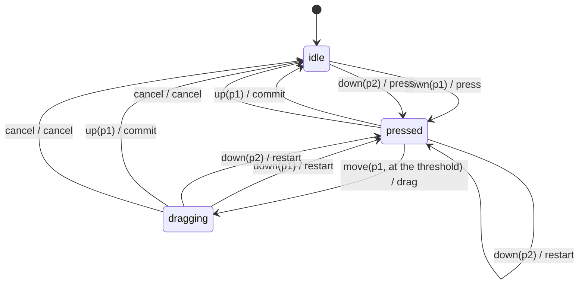

# Behaviour map (generated by tools/map/generate.ts; do not edit)

## The gesture machine (src/editor/input/pointer/machine.ts)

Ignored on purpose:

- idle + move(p1, below the threshold): nothing is pressed: a move with no press is the hover, which the pointer owner draws outside the machine
- idle + move(p1, at the threshold): nothing is pressed: a move with no press is the hover
- idle + move(p2): nothing is pressed: a move with no press is the hover
- idle + up(p1): a release with no press (pressed outside the window): nothing to end
- idle + up(p2): a release with no press: nothing to end
- idle + cancel: nothing is open to cancel
- pressed + move(p1, below the threshold): below drag.threshold a press stays a press (a click)
- pressed + move(p2): another pointer does not join the gesture
- pressed + up(p2): another pointer does not end the gesture
- dragging + move(p1, below the threshold): the drag follows the pointer through its owner (events.ts onMove), which draws it; the machine stays dragging
- dragging + move(p1, at the threshold): the drag follows the pointer through its owner, which draws it; the machine stays dragging
- dragging + move(p2): another pointer does not join the gesture
- dragging + up(p2): another pointer does not end the gesture

## The modes of interaction (src/editor/input/modes.ts)

Modes: pointer-gesture, picker-session, typing, context-menu, command-bar, dialog, picker, rename, text-edit, preview, confirmation.

| While | Never opens |
|---|---|
| pointer-gesture | context-menu, command-bar, dialog, picker, rename, text-edit, preview, confirmation |
